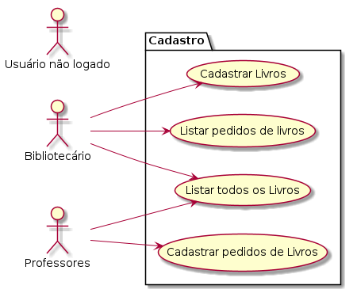

##  Desafio Técnico

A biblioteca desempenha um papel fundamental na vida acadêmica dos estudantes universitários, sendo um espaço essencial para a pesquisa, aprendizado e desenvolvimento intelectual. Ela oferece acesso a uma vasta coleção de livros, periódicos, artigos científicos e materiais digitais que auxiliam na construção do conhecimento em diversas áreas. Além disso, proporciona um ambiente propício para o estudo individual e em grupo, contribuindo para a concentração e a troca de ideias. Com a orientação de bibliotecários especializados, os alunos podem aprimorar suas habilidades de busca e análise de informações, tornando-se mais críticos e autônomos em sua formação acadêmica.

Crie um cadastro em PHP para a biblioteca. O bibliotecário poderá cadastrar livros adquiridos. Os campos que devem estar cadastrados são: 

 - Título do livro
 - Autor
 - Editora
 - ISBN

O bibliotecário poderá listar todos os livros cadastrados.
O bibliotecário poderá também acessar a lista de pedidos, ou seja, o que os professores cadastrar como recomendações para futura compra.

Os professores poderão acessar o seu sistema e listar todos os livros presentes na biblioteca.

Os professores também poderão cadastrar recomendações para compras futuras.

Os campos que devem estar cadastrados são: 

 - Título do livro
 - Autor
 - Editora
 - ISBN

### 1- DashBoard - Área de login/logout
- Com uso de sessões (sessions), criar uma área de login. Permitir encessar sessão (logout). Para realizar login/logout, necessário ter um único login e senha como professor. Estas senhas serão compartilhadas entre os professores.

- Login: <b>professor</b>
- Senha: <b>professor</b>

Para realizar login/logout, necessário ter um único login e senha como bibliotecário. Temos apenas um bibliotecário e sua senha não será compartilhada.

- Login: <b>biblio</b>
- Senha: <b>biblio</b>

### 2- Cadastrar Livros e pedidos
2.1 Cadastrar os livros 
 em arquivo texto. <b>Será possível realizar o cadastro somente em uma sessão ativa como bibliotecario</b>. Ao tentar cadastrar em uma sessão desativada, redirecionar para a área de login. Ao tentar cadastrar em uma sessão ativa como professor, redirecionar para a área do painel (Dashboard).

- No arquivo texto, o padrão de gravação deve ser: Título do livro, seguido de uma barra, Autor , seguido de uma barra,Editora , seguido de uma barra e o ISBN do livro.

Exemplo de uma linha do conteúdo no arquivo

`	
PHP Programando com Orientação a Objetos|Pablo Dall’Oglio|Novatec|978-85-7522-691-9
`
- O cadastro dos livros deve ser salvo no arquivo texto <b>livros.txt</b>.

2.2 Cadastrar a lista de pedidos dos professores
 em arquivo texto. <b>Será possível realizar o cadastro somente em uma sessão ativa como professor</b>. Ao tentar cadastrar em uma sessão desativada, redirecionar para a área de login. Ao tentar cadastrar em uma sessão ativa como bibliotecário, redirecionar para a área do painel (Dashboard).

- No arquivo texto, o padrão de gravação deve ser: Título do livro, seguido de uma barra, Autor , seguido de uma barra,Editora , seguido de uma barra e o ISBN do livro.

Exemplo de uma linha do conteúdo no arquivo

`	
PHP Programando com Orientação a Objetos|Pablo Dall’Oglio|Novatec|978-85-7522-691-9
`
- O cadastro dos livros deve ser salvo no arquivo texto <b>pedidos.txt</b>.

### 3- Ler todos os livros
- <b>Em uma área de sessão ativa como professor ou bibliotecário</b>, permitir ler todos os registros cadastrados nos arquivos texto. Caso não esteja em uma sessão ativa, redirecionar para a área de login.

- Seu sistema terá um botão "Visualizar livros". Ao clicar, deve carregar uma página php, que irá acessar todos os registros do arquivo texto <b>livros.txt</b> e apresentar ao usuário logado.

Dica: Pesquise a função explode na documentação.

### 4- Ler todos os pedidos cadastrados

- <b>Em uma área de sessão ativa como bibliotecário</b>, permitir ler todos os registros cadastrados nos arquivos texto. Caso não esteja em uma sessão ativa, redirecionar para a área de login.

- Seu sistema terá um botão "Visualizar pedidos". Ao clicar, deve carregar uma página php, que irá acessar todos os registros do arquivo texto <b>pedidos.txt</b> e apresentar ao bibliotecário.

Dica: Pesquise a função explode na documentação.

- Tecnologias: PHP Estruturado.
